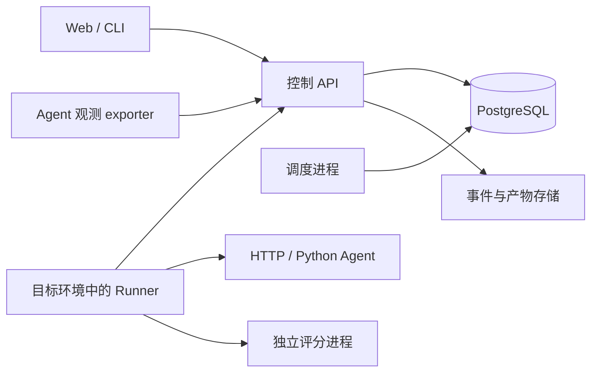

# Eyes

**面向团队自托管的 AI Agent 评测与执行观测平台。**

Eyes 把测试集、Agent 执行、评分依据和过程证据关联起来，帮助开发者判断任务是否完成、理解失败原因，以及比较 Agent 修改后的改善与退化。

你可以导入自己的任务和评分规则，通过 Runner 调用外部 Agent，查看逐用例结果、工具事件和产物，再生成固定的回归报告。也可以只接收 Agent 的过程事件，用于日常执行观测。

当前版本为 **0.1.0，处于真实接入与可靠性验收阶段**。已有 Python Agent 的真实执行、评分和证据展示记录；完整发布验收仍在推进。

## 主要能力

| 能力          | 当前实现                                                       |
| ------------- | -------------------------------------------------------------- |
| 自定义评测    | JSONL 测试集、版本化用例、规则评分和可信 Python 评分器         |
| Agent 接入    | 通用 HTTP 适配器、本地 Python 适配器，按能力和凭据匹配 Runner  |
| 执行调度      | 独立执行与评分额度、租约和心跳、超时、取消、未知状态保留       |
| 多 Agent 批次 | 一次创建多个独立实验，成员分别配置任务集、评分器与并发         |
| 执行证据      | SDK 事件、trace/span 关联、产物上传与摘要校验、证据完整性标识  |
| 独立评分      | 评分绑定固定证据清单，支持错误重试和重新评分，保留历史         |
| 回归对比      | 逐用例可比性检查、改善/退化统计、固定报告及 CLI 质量门槛       |
| Web 控制台    | 实验、批次、用例审阅、评分历史、回归报告、目录与运行状态       |
| 被动观测      | 独立会话/任务事件入口、执行流程图；当前真实接入案例为 Deta CLI |
| 运维          | 数据库迁移、存储审计、证据保留、文件回收及数据库/证据备份恢复  |

模型评分可以通过可信 Python 评分器接入。内置评分器不会自动判断任意业务任务，也不会把 Agent 自述当作任务已完成的证明。

## 两条使用路径

### 主动评测

接入 Agent → 导入测试集 → 发布评分器 → 创建实验或批次 → Runner 执行 → 查看评分与证据 → 对比迭代。

每次实验冻结目标、测试集、评分器和执行配置。执行状态、评分结论与证据完整性分别记录：执行成功不等于任务质量通过，`sealed` 只代表声明采集范围已封存。

重新评分产生新的 ScoreRun，不覆盖旧记录。回归报告默认选择首个成功执行的最早评分；Web 也支持显式选择历史评分，生成绑定所选记录的新报告。

### 被动观测

在 Agent 中照常发起任务 → exporter 上报实际事件 → Eyes 展示会话、模型和工具调用。

此路径不需要测试集、评分器或 Runner，不创建评测实验。目前 Deta CLI 已有真实接入和离线补传记录；MewCode 当前通过主动评测的 Python 桥接接入。详见[被动观测说明](docs/observation.md)。

## 系统结构



控制后端管理版本、实验、调度状态、评分和证据；Runner 主动通过认证 API 领取、续租并上报，不直接连接数据库。目标 Agent 负责自己的推理和工具执行，适配器负责转换接入接口。

主要技术：Python 3.14+、FastAPI、Pydantic、SQLAlchemy、PostgreSQL、OpenTelemetry，以及 React、TypeScript、Vite 和 shadcn/Base UI。

## 当前验证进度

| 范围          | 已有证据                                                                                                    | 尚未覆盖                                                  |
| ------------- | ----------------------------------------------------------------------------------------------------------- | --------------------------------------------------------- |
| MewCode 评测  | 2026-10-09：3/3 执行成功、3/3 独立评分通过，共 12/12 项功能检查；3/3 sealed，53 条事件、6 份产物及 Web 核对 | 完整 MewCode 服务、复杂仓库任务、远端取消、重启恢复与容量 |
| 多 Agent 执行 | Deta/Zeta 两个 Python Agent 的真实并发，峰值 3 个任务；受控工作进程中断与批次取消                           | 真实 HTTP Agent、Runner 整体崩溃、网络/数据库故障         |
| 回归与部署    | 固定报告、证据跳转、部分 CLI 门槛、历史 Compose 部署和数据库备份恢复                                        | 真实版本改善/退化、含完整事件和产物的恢复、生产容量       |
| 本轮 Bug 修复 | 单项上传退避、孤立文件隔离、完整产物存储就绪检查、Web 历史评分选择已实现并通过相关静态检查/构建             | 故障注入及完整浏览器行为验收                              |

MewCode 目前是 Eyes 的主要被测 Agent，用于验证平台能力。上述三任务结果是基础功能冒烟记录，不代表 MewCode 的完整编码能力或稳定性。

最新证据见 [MewCode 验证记录](docs/mewcode-validation.md)、[双 Agent 记录](integrations/zeta/README.md)和 [Bug 修复计划](docs/bug-fix-plan.md)。早期文档保留当时状态，应结合日期和后续追加记录阅读。

## 启动控制平台

### Docker Compose

需要 Docker Engine 与 Compose，或运行 Linux 容器的 Docker Desktop。在项目根目录执行：

```sh
cp deploy/.env.example deploy/.env
```

将 `deploy/.env` 中的 `POSTGRES_PASSWORD` 改为自行生成的随机十六进制密码。PowerShell 可用 `Copy-Item deploy/.env.example deploy/.env` 复制文件。配置完成后：

```sh
docker compose --env-file deploy/.env -f deploy/compose.yaml up --build -d
docker compose --env-file deploy/.env -f deploy/compose.yaml exec api eyes-admin bootstrap --name default
```

`bootstrap` 在首次初始化时创建项目，输出项目 ID 和一次性管理令牌；不要把它当作每次重启的步骤。保存令牌，在 Web 的“连接设置”中连接项目。

| 入口       | 默认地址                           |
| ---------- | ---------------------------------- |
| Web 控制台 | http://127.0.0.1:8080              |
| 控制 API   | http://127.0.0.1:8000              |
| API 文档   | http://127.0.0.1:8000/docs         |
| 就绪检查   | http://127.0.0.1:8000/health/ready |

Compose 包含 PostgreSQL、迁移、API、Scheduler 和 Web，**不包含可直接执行任意 Agent 的 Runner**。仅启动控制平台不会自动运行任务。数据库和证据使用独立数据卷。

通用 Compose 方案有历史部署记录；本次 Windows/MewCode 实测使用的是独立 Windows PostgreSQL、Linux API/Runner 和原生 Scheduler/Web，完整 Compose 部署未在该环境验收。其实际启动方式见 [MewCode 接入说明](integrations/mewcode/README.md)。

### 源码开发

API 与 Runner 使用 Linux/macOS 的 POSIX 能力。Windows 上请将这两个组件放在 Linux 环境中运行；已有实测方案采用 Linux 容器。目录 `fsync`、进程组及资源限制尚不支持完整原生 Windows 路径。

准备 Python 3.14+、uv、Node.js 22.12+ 和可用的 PostgreSQL。Linux/macOS 上：

```sh
uv sync --frozen
cp .env.example .env
```

编辑 `.env` 的 `EYES_DATABASE_URL`，连接专用 PostgreSQL 数据库，再执行：

```sh
uv run alembic upgrade head
uv run eyes-admin bootstrap --name default
uv run eyes-server
```

在另一终端运行 `uv run eyes-scheduler`，API 与 Scheduler 使用相同数据库及调度配置。启动前端：

```sh
cd frontend
npm ci
npm run dev
```

开发前端默认地址为 http://127.0.0.1:5173，API 为 http://127.0.0.1:8000。API 使用其他地址时，在 `frontend/.env.local` 配置 `EYES_API_PROXY_TARGET`；示例见 [frontend/.env.example](frontend/.env.example)。Web 的项目令牌只保存在页面内存中，刷新后需重新连接。

## 接入 Agent 与 Runner

在目标所在的 Linux/macOS 环境安装 Eyes，复制并修改配置：

```sh
cp deploy/runner.example.toml runner.toml
uv run eyes-runner --config runner.toml plugins
uv run eyes-runner --config runner.toml status
```

先发布目标版本和评分器，再在控制端签发限制到该项目、目标及执行/评分工作类型的 Runner 令牌。将其通过 `EYES_RUNNER_TOKEN` 环境变量提供，随后运行：

```sh
uv run eyes-runner --config runner.toml run
```

- HTTP 接入：配置允许的 origin，并按现有任务接口实现请求、结果及实际支持的取消/查询行为。
- Python 接入：配置可信的执行、准备、清理入口及解释器；评分器可以使用独立解释器。
- 多个 Runner 使用不同凭据与状态目录。容器内的 `localhost` 指向该容器，应按实际网络配置服务地址。
- 会话隔离、环境隔离、取消和幂等必须如实声明，Eyes 据此匹配任务和限制并发。

完整步骤见 [Agent 接入文档](docs/agent-integration.md)。MewCode 桥接、运行配置与采集工具位于 [integrations/mewcode](integrations/mewcode/README.md)。

语言无关的[统一 Agent 协议 v1](docs/agent-protocol.md)目前只有文档、类型契约和 JSON Schema；统一协议客户端与参考服务尚未实现，不能替代现有可运行的 HTTP/Python 接入。

## 回归与运维

开发者 CLI 使用 `EYES_TOKEN` 提供项目令牌，默认连接 `http://127.0.0.1:8000`；可用 `--url` 指定 API。

```sh
uv run eyes --help
uv run eyes compare --file comparison.json --key release-comparison
uv run eyes gate REPORT_UUID
uv run eyes-ops audit
uv run eyes-ops maintain
```

`comparison.json` 使用真实实验和评分器 UUID，请求格式见[平台说明](docs/platform.md)。`eyes gate` 的退出码分别为：0 通过、1 不通过、2 无法判定、3 配置或服务错误。

`eyes-ops` 在控制端使用其数据库与证据卷配置。`maintain` 默认预览，`--apply` 才执行清理。备份恢复、升级和保留策略须按[运维说明](docs/platform.md)操作。

## 数据与执行边界

- 项目管理/读取令牌、Runner 令牌和模型 API key 分开使用。目标快照保存密钥引用，不保存明文凭据；本机 `.env`、`data/` 和前端本地配置不提交 Git。
- Python 插件及 shell 按可信代码管理。独立目录、独立进程或本轮容器部署不能自动视为安全沙箱。
- 未确认停止的外部任务保持未知；本地进程退出或租约失效不证明远端任务已经停止。
- 观测范围取决于实际接口与埋点。缺失、截断、丢弃和过期证据应明确显示，不能推断隐藏执行过程。
- 重新评分、迟到证据和报告生成保留历史；显式选择新评分不会改变原实验汇总。
- Outbox 孤立文件保存在私有 `outbox-orphaned` 目录供排查，需人工管理保留；被动观测记录尚无自动保留清理策略。

## 文档与源码导航

| 主题               | 入口                                                                               |
| ------------------ | ---------------------------------------------------------------------------------- |
| 架构与阶段验收     | [architecture.md](docs/architecture.md)                                            |
| 后端、认证与 API   | [backend.md](docs/backend.md)                                                      |
| Agent/Runner 接入  | [agent-integration.md](docs/agent-integration.md)                                  |
| 回归、证据与运维   | [platform.md](docs/platform.md)                                                    |
| 多 Agent 批次      | [multi-agent-batches.md](docs/multi-agent-batches.md)                              |
| 被动观测           | [observation.md](docs/observation.md)                                              |
| Web 与前端质量     | [frontend.md](docs/frontend.md)、[frontend-quality.md](docs/frontend-quality.md)   |
| MewCode 接入与实测 | [接入说明](integrations/mewcode/README.md)、[验证记录](docs/mewcode-validation.md) |
| 故障处理修复进度   | [bug-fix-plan.md](docs/bug-fix-plan.md)                                            |
| 开发约定           | [AGENT.md](AGENT.md)                                                               |

```text
src/eyes/contracts/   公共数据契约
src/eyes/server/      控制 API、调度、证据、评分、回归与运维
src/eyes/runner/      宿主机执行、进程控制及持久化发送队列
src/eyes/adapters/    HTTP/Python 适配器
src/eyes/sdk/         事件和链路采集
src/eyes/scorers/     内置规则评分
src/eyes/cli/         开发者 CLI
frontend/            Web 控制台
migrations/          PostgreSQL 迁移
deploy/              通用部署示例
integrations/        真实 Agent 接入案例
docs/                设计、使用和验证记录
```

## 下一步

当前重点是完成四项修复的行为验收、可靠部署与故障恢复，补齐真实 HTTP 接入、真实版本回归和含产物的备份恢复记录，再开展容量及长期运行验证。功能实现、静态检查和真实运行验收分别记录，以实际证据判断交付阶段。
