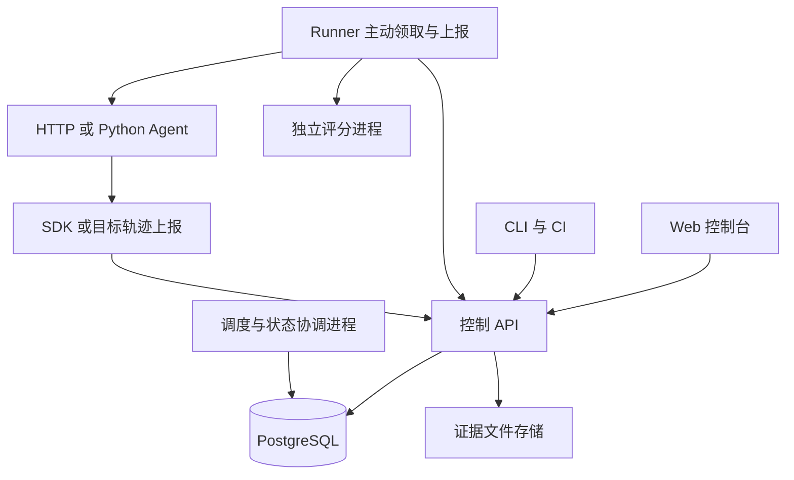

# Eyes 首版架构方案

本文把已确认的产品能力组织成可实施的框架，作为接口、数据库和开发工作的基线。系统定位为面向单团队自托管的 Agent 测试与执行观测平台。控制后端基础和 HTTP/Python Agent 接入代码已按本文实现，具体范围见 [后端开发说明](backend.md) 和 [Agent 接入文档](agent-integration.md)，运行证据见 [后端验证记录](backend-validation.md)。Web 控制台已实现主要页面和公开 API 操作，构建与验证边界见 [前端说明](frontend.md)。本文的完整能力和各阶段验收仍是交付目标。

## 系统边界

Eyes 负责测试集与评分器版本、实验配置、任务调度、证据保存、评分和回归对比。目标 Agent 负责自身的推理、工具调度及业务行为。适配器负责翻译目标协议并声明其实际能力。

HTTP Agent 和 Python 适配器两种通用接入与宿主机 Runner 已有代码实现；Python 路径已有 Deta、Zeta 和 MewCode 的真实运行记录，2026-10-10 真实 MewCode HTTP 基本闭环也已完成。单轮任务已有执行、评分与证据闭环；用例模型预留有序对话步骤，目前拒绝非空 `steps`，多轮驱动后续实现。模型代理作为后续采集适配器，不阻塞首版。统一 Agent 协议已接入 `agent_http` Runner 客户端与持久化参考服务，旧 HTTP/Python 保留，首次 Docker 阻塞已解除，见[运行时说明](agent-http-runtime.md)与[实际记录](agent-http-validation.md)。参考服务的 SQLite 仅保存外部接入端单机协议状态，不改变 Eyes PostgreSQL 架构或迁移；完整故障及能力矩阵仍待验收。

首版插件由项目维护者安装，按可信代码管理。独立进程提供故障隔离；开放任意用户代码执行前，需要另行设计容器或更强的隔离边界。

## 被动观测补充（2026-10-03）

新增用户确认的本地 Agent 被动观测路径：用户在 Agent 中发起任务，Agent exporter 直接向 observation API 上报；以 ObservationSource → ObservedRun → ObservedEvent 保存来源、会话与任务内序列。该路径不创建 Experiment/Attempt，也不经过调度或评分。来源写入令牌与项目读取/管理令牌分离。采集、状态与恢复边界见 [被动观测说明](observation.md)。

## 运行结构

采用模块化后端、独立调度进程和独立 Runner，共享一套协议定义。API 和调度进程由同一后端代码包提供，领域规则只保留一份实现。



Runner 主动通过认证后的 HTTP 请求领取工作、续租和上传结果，适用于开发者本机及内网环境。Runner 不直接连接数据库。API 在短事务中完成领取、并发额度预留和状态写入；调度进程扫描到期任务、安排安全的准备阶段重试，并将执行意图之后失联的任务标记为 unknown、保留额度。当前调度进程不主动查询远端未知任务，自动协调仍是后续目标。

### 模块职责

| 模块 | 负责 | 对外约定 |
| --- | --- | --- |
| catalog | 目标能力、测试集版本、用例、评分器版本 | 发布后不可变的配置和内容引用 |
| experiments | 创建实验、冻结配置、生成用例运行 | 实验快照和运行标识 |
| scheduling | 任务领取、租约、并发额度、取消及恢复 | 带领取令牌的工作项 |
| evidence | 事件接收、去重、轨迹查询、产物索引 | 可验证来源的证据引用 |
| evaluation | 创建评分任务、校验评分输出、独立保存结果 | 评分版本、结论与证据 |
| comparison | 对齐可比用例、计算回归、执行质量门槛 | 明确分母和不确定项的对比报告 |
| runner | 执行适配器、进程生命周期、缓冲上报、清理 | 结果、心跳和任务产物 |

Web 与 CLI 使用同一套公开 API。业务规则不放在路由和前端中。插件通过协议读取任务和返回结果，不能直接修改平台数据库。

## 首版技术选择

| 层 | 建议 | 选择依据与边界 |
| --- | --- | --- |
| 后端与 Runner | Python、FastAPI、Pydantic | 复用 Python Agent 接入生态，以结构化协议约束输入输出 |
| 数据访问 | SQLAlchemy、Alembic、PostgreSQL | 统一事务、迁移和任务状态；生产语义直接基于 PostgreSQL 验证 |
| 调度 | PostgreSQL 工作表、短事务领取、租约与心跳 | 实验状态和工作入队在同一事务完成；首版不增加外部消息中间件 |
| 证据文件 | 服务端受控本地卷，元数据存 PostgreSQL | 面向单机自托管；保留 ArtifactStore 接口，横向扩展前切换共享对象存储 |
| 追踪 | OpenTelemetry SDK、W3C Trace Context、Eyes 证据接口 | 统一链路标识；大型输入输出单独保存为证据引用 |
| 前端 | React、TypeScript、Vite、shadcn/Base UI、Tailwind CSS 4 | 运行列表、执行详情和逐用例对比；组件选择已落地，见前端说明 |
| 部署 | Docker Compose | 固定版本、数据卷、健康检查和迁移步骤；Runner 也可在宿主机独立运行 |

当前项目保持 Python >=3.14。依赖锁定在 uv.lock；历史 Compose 部署及 PostgreSQL 迁移、报告持久化和无产物备份恢复已有运行记录，见 [平台验证记录](platform-validation.md)。当前迁移 head 为 `0004_experiment_batches`。Windows/MewCode 记录使用 Linux API/Runner 与独立 PostgreSQL，不能作为原生 Windows API/Runner 或该环境完整 Compose 的验收；见 [MewCode 验证记录](mewcode-validation.md)。完整故障恢复与容量仍待验证。

PostgreSQL 的 `SKIP LOCKED` 可用于多个消费者领取队列表中的工作；它只解决领取时的行锁竞争，并不自动提供租约、并发限额、公平性或外部执行幂等。[PostgreSQL SELECT 文档](https://www.postgresql.org/docs/current/sql-select.html#SQL-FOR-UPDATE-SHARE)

链路上下文应随调用传播，不能仅靠时间或相同文本拼接父子关系。[OpenTelemetry Context propagation](https://opentelemetry.io/docs/concepts/context-propagation/)

## 核心对象与关联

| 对象 | 核心内容与约束 |
| --- | --- |
| Project | 数据、访问凭据、目标和并发配置所属范围；首版可使用一个默认项目 |
| Target / TargetVersion | Target 是项目内的稳定目标及容量池，同名称版本共享额度；TargetVersion 固定适配器配置、外部版本、能力和密钥引用 |
| DatasetVersion 与 CaseVersion | 不可变内容、内容摘要、稳定用例标识、输入、预期、环境要求 |
| ScorerVersion | 代码或规则摘要、依赖标识、配置 schema、所需证据、分数含义和阈值 |
| Experiment | 绑定上述版本、运行限制、超时、重复次数和明确的尝试选择规则 |
| CaseRun | 实验中的一个用例及重复序号；每个 CaseRun 可以有多次 Attempt |
| Attempt | 一次实际执行尝试、幂等键、目标操作标识、执行状态和清理状态 |
| WorkItem 与 Lease | 执行或评分工作项、领取者、到期时间、领取令牌和额度预留 |
| Trace、Event 与 Artifact | attempt 关联、来源、内容摘要、覆盖范围、完整性及保留状态 |
| ScoreRun 与 Score | attempt、评分器快照、固定证据清单、评分状态、结论和理由 |
| ComparisonReport | 固定两组实验与评分记录，保存可比集合、聚合口径和门槛结果 |

重试创建新的 Attempt。用户要求重新运行时创建关联原实验的新实验；发布后的输入和历史结果不被改写。补充事实、重新评分和人工核对通过带来源的新记录表达。

Experiment、CaseRun、Attempt 和 OTel trace 是不同概念。首版每个 Attempt 创建一个执行根 trace；保留外部已有 trace 时通过明确链接关联。独立评分有自己的 trace，并链接到被评分的 Attempt。

## 四份核心接入契约

协议以 Pydantic 模型及其 JSON Schema 表达，并带 `schema_version`。当前公共 `Contract` 允许省略该字段并默认解析为 `1.0`，拒绝其他版本、未知字段及缺少的其他必需字段；严格拒绝缺失版本仍是开发规范中的待落实要求。独立的统一 Agent 协议使用必填 `protocol_version`，由新客户端严格校验。Runner 注册时协商协议版本和可执行能力。

### 目标适配器

必需方法为 `capabilities`、`prepare`、`execute`、`cleanup`；`cancel` 和 `reconcile` 按能力提供。`reconcile` 用于凭远端操作标识查询未知任务的实际状态。

能力声明至少包含接入类型、会话隔离、环境隔离、可取消性、幂等支持、状态查询能力及观测范围。平台据此校验是否允许并发、恢复及重试。

执行输入携带 experiment、case_run、attempt、幂等键、截止时间、trace context、任务输入和受限环境配置。输出包含执行状态、任务结果、远端操作标识和产物引用。

传给同一外部操作的传输重试使用同一幂等键；重新发起一次业务执行使用新的 Attempt 和新的键。目标未声明幂等支持时，平台不能因为提供了键就假定去重生效。

### 测试集

首版使用 JSONL 导入，每行一个用例。字段包含稳定 `case_id`、`input`、可选 `expectations`、`tags`、环境要求和产物要求；导入采用整体校验后发布，不静默跳过错误行。

每个已发布版本固定用例内容及摘要。可变环境通过版本化准备逻辑与运行时检查记录描述；外部业务状态无法快照时显式记录限制。预留 `steps` 表达多轮输入，未实现的步骤类型在导入时拒绝。

### 评分器

输入为用例预期、执行结果和只读证据视图。平台接口只暴露本次授权的证据，不提供跨项目遍历权限；可信插件所在进程的操作系统权限仍需由部署环境约束。模型评分所需网络和凭据由维护者显式配置。

输出区分评分运行状态与质量结论：运行状态为 `completed`、`error`、`insufficient_evidence` 或 `skipped`；有效结论为 `pass`、`fail` 或适用范围内的 `not_applicable`。数值分数可选，必须声明范围和方向。

评分保存理由、证据引用及评分器配置。证据引用必须属于本次 Attempt 且确实存在；缺失引用不能作为通过依据。首版提供规则评分与可信 Python 评分接口，模型评分按同一接口扩展。

### 执行事件与产物

事件包含 event_id、producer_id、attempt_id、trace_id、span_id、可选 parent_span_id、生产者序号、发生时间、类型、来源和脱敏后的数据或引用；服务端补充接收时间。

同一项目内按 producer_id 与 event_id 去重。相同标识但内容不同的上报返回冲突并记录诊断。重复标识相同且摘要相同的上报返回既有接收结果。跨生产者不假定存在全局事件顺序。

SDK 使用有界后台缓冲并提供 flush；上报失败和丢弃计数必须可见。控制端持久化完成后才确认接收。Runner 对待确认批次使用有界磁盘缓冲，崩溃后可重传；SDK 未持久化的数据仍可能丢失。

产物先上传到临时位置，完成大小、摘要和权限校验后发布可读取引用，再在事务中登记。未登记文件定期回收，数据库中未完成的上传保持 pending。文件名不能指定服务端任意路径。

## 一次实验如何执行

1. API 验证目标、数据集和评分器兼容性；冻结版本、配置和幂等请求标识。
2. 同一事务创建 Experiment、CaseRun 及执行 WorkItem。重复创建请求返回同一实验；相同请求标识但参数不同返回冲突。
3. Runner 领取与自身环境和插件能力匹配的工作。API 在事务中锁定额度并领取任务，生成 lease token 和 Attempt。
4. Runner 准备独立会话或工作区，记录执行意图，再调用目标；可获取时立即持久化远端操作标识。
5. Runner 续租并上传事件与产物，执行结束后进行清理，再上报包含独立清理状态的执行结果；执行结束后的独立清理记录接口仍待实现。
6. 控制端按证据结束信号和等待期限生成证据清单。按每个评分器的证据要求决定开始评分或标记证据不足。
7. 评分工作通过同一调度机制领取，在独立评分进程执行，使用与 Agent 执行分开的容量限制。
8. 聚合当前执行与评分状态，生成可追溯结果；对比和 CI 使用固定结果快照。

调度以排队时间和唯一 ID 确定顺序。领取的 WorkItem、租约及全局和目标额度在同一事务更新，额度按固定顺序加锁。项目公平调度可以后续增加，首版不承诺严格公平性。

## 状态与故障规则

### 执行状态

Attempt 的正常流程为 `claimed → preparing → running → succeeded / failed`。准备失败可直接终止；取消和截止时间可以从任何活动阶段发起。

只有确认本地执行已终止或远端已停止，才能结束为 `cancelled` 或 `timed_out`。已发出取消请求但未确认时保留 `cancel_requested`；超过协调期限后转为 `unknown`，并记录取消或超时原因。

`unknown` 表示平台无法确定目标状态。租约失效会停止旧领取者修改当前调度状态，但无法自动终止外部副作用。当前 Runner 只在有效租约生命周期内按适配器能力取消/查询；重启后的未知任务由管理端 `resolve` 追加人工核对记录。协调进程主动根据目标查询结果追加核对记录仍是后续设计，不能视为已实现。

### 分别记录执行与证据状态

- 执行状态描述目标调用；清理状态为 pending、succeeded、failed 或 unknown。
- 证据状态为 collecting、sealed、partial、unavailable 或 expired。sealed 只表示已声明的采集范围完成，不代表所有内部行为可见。
- 评分状态独立于执行状态。执行异常可供专门的异常评分器检查，但不满足评分器前置条件时要跳过或判定证据不足。
- 实验调度状态可以结束，同时仍含 unknown 执行或 incomplete 评分；页面和 API 应明确列出未解决项。

封存证据后到达的事件保存为补充证据，产生新的清单版本。已完成评分继续引用原清单，需要纳入新证据时创建新的 ScoreRun。

### 必须处理的故障

| 情况 | 处理规则 |
| --- | --- |
| Worker 领取后、明确尚未执行时退出 | 旧 lease 失效后重新排队，记录原尝试 |
| 存在执行意图，但调用是否发生不确定 | 当前失联后记录 unknown 并保留额度、等待显式核对；远端查询或幂等协议的自动恢复仍为后续目标 |
| Runner 失联、远端可能仍在运行 | 保留目标额度占用或冻结该目标的新分配，直到确认停止；不能凭租约过期认定资源已释放 |
| 旧 Runner 迟到提交 | 领取令牌校验阻止覆盖当前状态；迟到证据可按身份和 Attempt 归档为补充事实 |
| 评分器崩溃 | 保存 scorer error，可独立重试评分，不重新执行目标 |
| 证据接收中断 | 发送端按接收确认重传，接收端去重；缓冲耗尽标记丢失 |
| 清理失败 | 独立显示失败原因，隔离未清理的工作区或环境资源，保留原结果 |

平台提供可重复投递的工作调度、受令牌保护的状态更新，以及按目标能力恢复的外部执行。外部业务副作用的恰好一次执行不属于通用保证。网络分区时严格限制远端实际并发，需要目标配合或暂停新的分配。

## 评分汇总与回归

比较键至少包括 case_id、用例内容摘要、评分器摘要及配置；环境和采集能力变化单独提示。Agent 版本变化是对比变量，不作为用例不可比的理由。

重试默认选择首个执行成功的 Attempt 进入常规质量评分；此前失败全部计入可靠性统计。全部失败的 CaseRun 保留为执行失败，不从总体分母消失。选择规则在创建实验时冻结，不允许事后挑选最高分。

报告同时给出计划用例数、执行成功数、有效评分数、通过数及未解决项。按评分器分别显示执行成功率、评分覆盖率、有效评分通过率；总体达标率以预先声明的适用 CaseRun 为分母。N/A、缺失和执行失败的计数必须可见。

重复运行以同一用例的重复序号记录，每个用例等权汇总并显示重复次数。不同重复策略需标记差异。首版报告分数与分布变化，不自动宣称统计显著性。

CI 门槛返回 `pass`、`fail` 或 `inconclusive`，同时列出未达标与证据缺口。CLI 为配置或服务错误保留独立退出码；默认只有 pass 返回成功，人工放行属于外部流程。

## 存储与访问边界

所有业务记录按 project_id 归属。Runner 凭据限制项目、目标和工作类型；证据上传只能关联已获授权的 Attempt。用户角色首版至少区分读取与执行管理。

目标与评分器凭据由运行环境的密钥引用提供。实验快照保存引用和可获取的版本标识；轨迹、报错与导出均执行敏感内容处理。大型载荷通过产物引用保存，并限制上传大小及保留期限。

备份包括数据库、证据卷和协议版本信息；恢复流程验证两者引用一致性。过期证据保留元数据和过期状态，历史评分显示证据已不可读。

首版提供服务就绪状态、Runner 心跳、队列等待时间、活动与未知任务数、评分错误及事件丢弃指标。容量根据实测发布，不预设没有证据的吞吐承诺。

## 代码组织与开发约束

以下目录已有实现；`server/observation/` 与 `server/operations/` 分别承载后续增加的被动观测和运维。后续扩展仍按里程碑创建实际文件，不提前建立空模块。

```text
src/eyes/
  contracts/        # 公共协议、版本与 schema
  server/
    api/            # 身份认证、请求与响应
    catalog/        # 目标、测试集及评分器版本
    experiments/    # 实验与用例运行
    scheduling/     # 工作领取、租约与恢复
    evidence/       # 事件、产物及证据清单
    evaluation/     # 评分任务与结果
    comparison/     # 可比性、汇总和门槛
    observation/    # 来源、观测任务与事件
    operations/     # 审计、保留清理与备份恢复
    storage/        # 数据库与证据文件实现
  runner/           # 主循环、心跳、进程与缓冲管理
  adapters/         # HTTP 与 Python 目标适配
  scorers/          # 内置规则和代码评分入口
  sdk/              # 显式采集与上下文传播
  cli/              # 面向开发者与 CI 的命令
frontend/
migrations/
docs/
deploy/
```

contracts 不依赖 server；Runner、SDK 和 CLI 依赖公共契约，不能依赖后端 ORM。HTTP 路由调用对应业务模块；SQL 事务和状态规则由后端维护，避免复制到适配器。

## 分阶段交付

| 阶段 | 可交付内容 | 完成依据 |
| --- | --- | --- |
| M0 契约定稿 | 四份协议、状态转换表、首版数据表、端点和 CLI 清单 | 对一个 HTTP Agent 与一个 Python Agent 逐项核对能力，关键故障都有明确处理规则 |
| M1 真实闭环 | 导入、实验、单 Runner 执行、代码评分、证据查询 | 两种真实接入分别产生可查询结果，其他开发者可按文档完成接入 |
| M2 并发与恢复 | 多 Runner、持久化调度、限额、取消、协调未知结果、重复上报处理 | 中断进程及网络后状态和证据可解释，记录真实并发及隔离验证结果 |
| M3 回归产品 | 运行列表、执行详情、比较、CLI 门槛 | 同一测试集验证一次改善和一次退化，评分能够追溯到固定证据 |
| M4 发布验收 | Compose、认证、迁移、备份恢复、运维和容量说明 | 在干净环境部署，恢复备份，并公布有环境说明的实测结果 |

各阶段均保留原始运行记录、版本和执行命令。M1 包含基础 API 与 Runner 认证；M4 完成共享部署的访问控制验收。M1 及以后同时维护接入文档，不把文档集中留到发布阶段。

当前平台已实现回归报告/CI、证据等待、实验证据保留清理和备份恢复工具，见 [平台说明](platform.md)。Python 真实闭环与双 Python Agent 的部分并发/中断场景已有记录；真实 HTTP 基本闭环已补齐，可选能力正向、完整并发故障恢复、真实版本改善/退化和容量验收仍有缺口，M0～M4 均不能标为完整验收。当前功能状态、待开发与待验证任务见 [开发计划](PLAN.md)。历史检查保留在各验证文档中。

## 尚需通过真实接入确定的事项

- 首批 Python 案例已有 Deta/Zeta/MewCode，HTTP 基本验收目标为 MewCode；其取消/资源明确不支持，其他真实目标及完整停止、幂等故障与隔离条件仍需核对。
- 明确发布支持的环境矩阵；已有 macOS 和 Windows/Linux 混合环境记录，原生 Windows API/Runner 尚不支持完整路径。
- 目标超时、租约、心跳、证据等待期限和容量默认值，根据真实任务耗时与故障演练确定。

这些事项影响配置和适配细节，不改变本文的模块边界。实现中若要改变公共协议、状态含义或已确认范围，先更新本设计并说明迁移影响。


## 2026-10-03：平台实现补充

保持原有模块和单机 PostgreSQL 架构。`0002_platform` 新增 EvidenceWait 与不可变 ComparisonReport。新实验冻结证据等待秒数，等待结束后才创建绑定具体清单的评分，不重绑已有 ScoreRun。回归报告固定首个成功 Attempt、明确的 ScoreRun 选择、可比性原因及门槛结果。

证据保留是不可变事实规则的一个明确生命周期操作：仅允许清除事件 data 和清单载荷，保留原摘要、标识、引用和过期时间，历史评分及报告不修改。过期证据拒绝重新上传、下载和评分。数据库和证据卷备份通过维护锁及导出快照保持一致；恢复仅面向空目标，并撤销旧 Runner 令牌以隔离恢复前的进程。细节及升级要求见 [平台说明](platform.md)。

## 多 Agent 批次（2026-10-08）

新增 ExperimentBatch → Experiment 分组。一个批次可原子创建多个 Agent 的独立实验，每个成员冻结自己的目标、测试集、评分器和执行配置，沿用现有工作队列、额度、取消及证据/评分流程。成员失败不主动取消其他成员；批次状态从成员状态派生，未知执行仍保留额度。不同测试集的质量结果分别展示。协议和升级说明见 [多 Agent 批次](multi-agent-batches.md)。
